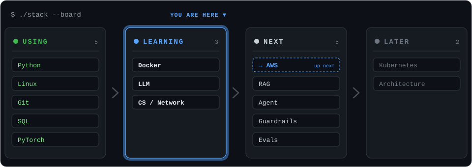

<p align="center">
  
</p>

<p align="center">
  
</p>

### PROJECTS

<table>
<tr>
<td width="333" valign="top">

`01`<br>
**Multimodal VQA**<br>
<sub>Image + Text VQA Pipeline</sub>

<sub>Python · PyTorch · Multimodal</sub>

🟢 **Completed**

</td>
<td width="333" valign="top">

`02`<br>
**AI Agent Lab**<br>
<sub>LLM Agent + Tools + Guardrails</sub>

<sub>Agents · MCP · Evals · Tracing</sub>

⚪ **Planned**

</td>
<td width="333" valign="top">

`03`<br>
**AI Cloud System**<br>
<sub>AI service on cloud infra</sub>

<sub>Docker · AWS</sub>

⚪ **Planned**

</td>
</tr>
</table>

<details>
<summary><b>ROADMAP</b> — 전체 로드맵 펼치기</summary>

```text
2026
│
├── Foundation
│   ├── CS
│   ├── Network
│   └── Linux
│
├── AI Application
│   ├── LLM API
│   ├── RAG
│   └── Tool Calling
│
├── AI Systems
│   ├── Agent
│   ├── Harness
│   ├── Guardrails
│   └── Evals
│
└── Infrastructure
    ├── Docker
    ├── AWS
    └── Kubernetes
```

</details>

**TOOLS I USE** &nbsp; `Python` `Git` `Linux` `SQL` `PyTorch`
